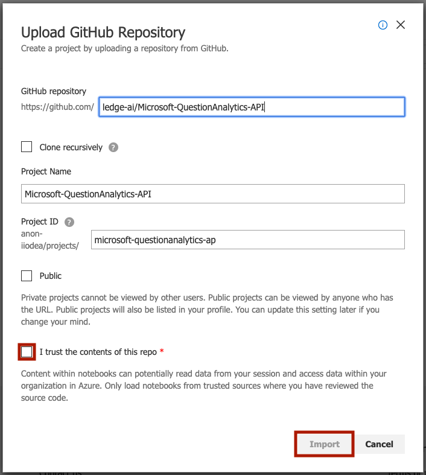
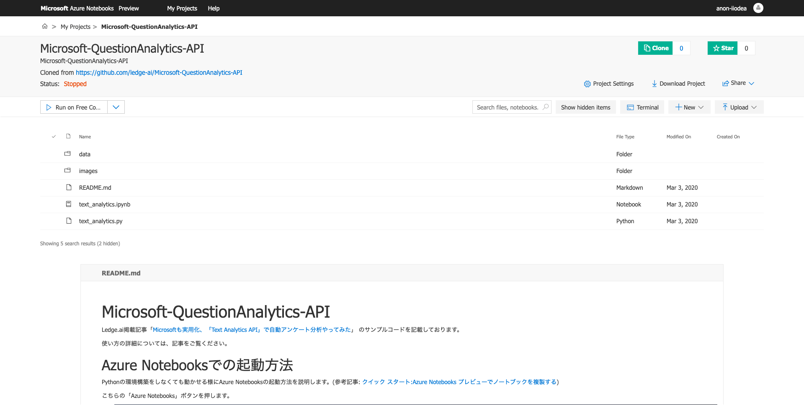

# Microsoft-QuestionAnalytics-API
Ledge.ai掲載記事「[Microsoftも実用化、「Text Analytics API」で自動アンケート分析やってみた]()」
のサンプルコードを記載しております。

使い方の詳細については、記事をご覧ください。

## Azure Notebooksでの起動方法
Pythonの環境構築をしなくても動かせる様にAzure Notebooksの起動方法を説明します。(参考記事: [クイック スタート:Azure Notebooks プレビューでノートブックを複製する](https://docs.microsoft.com/ja-jp/azure/notebooks/quickstart-clone-jupyter-notebook))

こちらの「Azure Notebooks」ボタンを押します。

LedgeのGithubアカウントから、ledge-ai/Microsoft-QuestionAnalytics-API をインポートします。

「I trust the contents of this repo」のチェックをした上で「Import」します。

リポジトリの複製が完了するのに時間がかかりますが、完了するとすべてのファイルがコピーされていることが確認できます。

これで「text_analytics.ipynb」を実行することができます。